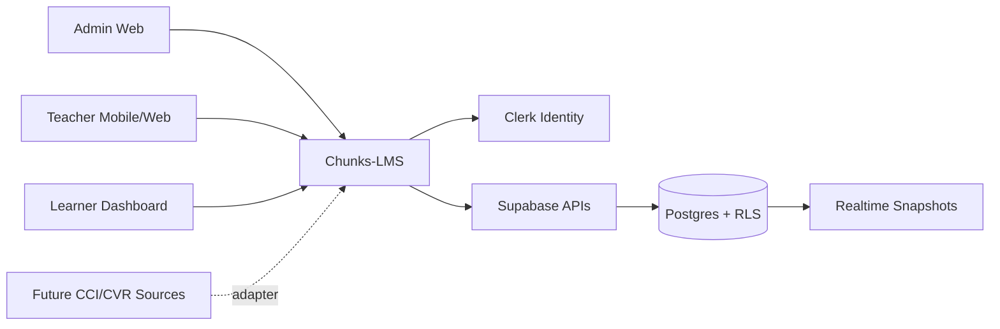
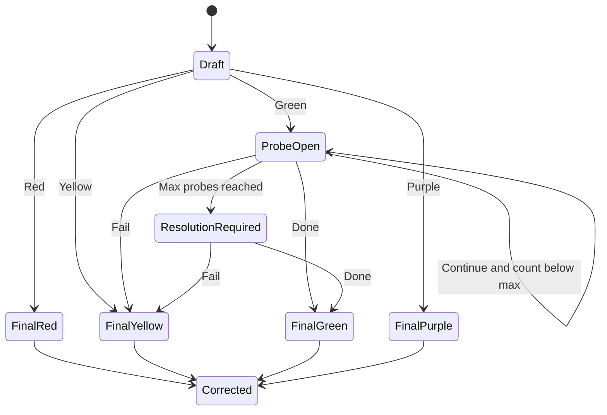
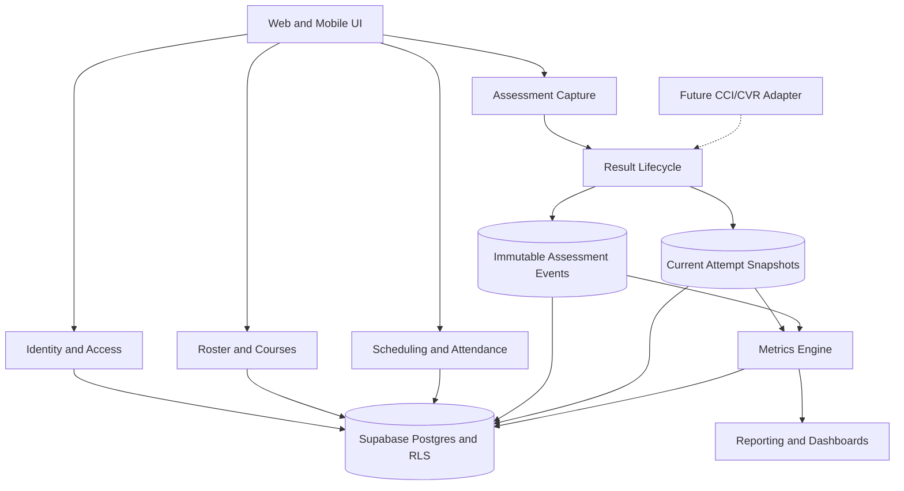

# Chunks-LMS Architecture Review

**Status:** Proposed for approval  
**Date:** 2026-07-11  
**Scope:** Architecture and product context only; no application implementation

## 1. Executive decision

Build **Chunks-LMS as a fresh, Postgres-centered hybrid modular monolith**:

- one React/TypeScript application;
- Clerk for authentication and organization identity;
- Supabase/Postgres as the system of record;
- immutable events for assessment/probe/correction history;
- current-state snapshots for fast mobile UX, realtime updates, and reporting;
- versioned metric templates;
- explicit module seams;
- CCI/CVR adapters deferred but anticipated.

Do **not** fork and delete from `chunks-offline-v1`. Reuse selected UI/reporting patterns and operational knowledge, but create a new schema and domain model.

## 2. Cross-review conclusion

### Alternatives considered

| Architecture | Strength | Main problem | Decision |
|---|---|---|---|
| Transactional modular monolith | Fastest V1; natural Supabase fit | Weak correction/probe auditability; historical metrics can drift | Reject as complete solution |
| Pure event sourcing with projections | Maximum auditability and extensibility | Too much operational and conceptual complexity for V1 | Reject for V1 |
| Hybrid transactions + immutable events + snapshots | Good auditability, simple current reads, strong reporting path | Requires disciplined event/snapshot consistency | **Recommend** |

The hybrid approach keeps event sourcing local to the part that earns it: **assessment result lifecycle**. Scheduling, roster, courses, and ordinary administration remain conventional transactional models.

## 3. System context

Chunks-LMS is a **measurement platform for Focus and Awareness**, not a learning-content authoring platform.

### Product boundary

Chunks-LMS owns:

- course/class/enrollment administration;
- class scheduling and attendance;
- teacher-observed assessment capture;
- result/probe/correction lifecycle;
- operational learning metrics;
- teacher and learner progress dashboards.

Chunks-LMS does not initially own:

- question content;
- resource libraries;
- lesson generation;
- audio generation;
- billing;
- general-purpose LMS content authoring.

## 4. Canonical domain model

### Core terms

- **Organization:** administrative ownership and authorization scope.
- **User:** authenticated person identity.
- **Teacher:** user authorized to teach exactly the assigned classes.
- **Learner:** assessed person with access to their own dashboard.
- **Course:** longitudinal learning program, initially `ERE-Level-B` or `ERE-Level-A`.
- **Class:** one teacher-led cohort for one course; default capacity three learners.
- **Enrollment:** learner membership in a class over a defined period.
- **Scheduled Session:** planned calendar occurrence.
- **Learning Session:** actual teaching/assessment occurrence.
- **Session Question:** ordered, resource-agnostic measurement opportunity.
- **Assessment Attempt:** one teacher observation for one learner and one session question.
- **Provisional Result:** initial color before required follow-up is resolved.
- **Probe Event:** `Fail`, `Continue`, or `Done` event following provisional Green.
- **Final Result:** result eligible for progress metrics.
- **Correction:** audit-preserving revision to a final result.
- **Metric Template Version:** immutable semantic and calculation definition.
- **Report Window:** explicit date/time scope used to calculate or compare metrics.

### Key invariants

1. A class has one active teacher in V1.
2. Class capacity defaults to three but is configuration, not schema logic.
3. A Session Question can have many Assessment Attempts—one per learner.
4. An Assessment Attempt has at most one effective Final Result.
5. Green provisional results must resolve through the probe flow before finalization.
6. Final results are not destructively edited; corrections append history.
7. Only finalized results feed metrics.
8. Presentation mode—learner-first or question-first—does not change stored semantics.
9. Questions are session-scoped and not identified globally by visible sequence alone.

## 5. Assessment state model

Recommended defaults:

- `max_probe_count = 2`, configurable by authorized admin;
- provisional Green is stored but excluded from progress metrics;
- every probe event stores order, outcome, actor, and timestamp;
- reaching max requires explicit Fail or Done; never infer a result automatically.

## 6. Recommended modules and seams

### Module responsibilities

1. **Identity and Access**
   - Clerk identity mapping, organization membership, role claims, RLS context.
2. **Roster and Courses**
   - courses, classes, teacher assignment, learner profiles, enrollment lifecycle.
3. **Scheduling and Attendance**
   - recurring schedule definitions, occurrences, rescheduling, cancellation, attendance.
4. **Assessment Capture**
   - question ordering, learner-first/question-first workflows, draft capture.
5. **Result Lifecycle**
   - provisional grade, probe transitions, finalization, corrections and invariants.
6. **Metrics Engine**
   - versioned templates, filters, windows, calculations and observations.
7. **Reporting and Dashboards**
   - teacher, admin and learner read models; period comparisons and chart selection.
8. **Audit Trail**
   - append-only assessment/probe/correction history and actor attribution.
9. **Integration Adapters**
   - future CCI/CVR or external resource references only when a second implementation exists.

### Deep interfaces

Prefer small behavioral interfaces rather than table-by-table repositories:

- `recordAssessment(command) -> AssessmentState`
- `resolveProbe(command) -> AssessmentState`
- `correctFinalResult(command) -> AssessmentState`
- `calculateMetric(query) -> MetricObservation`
- `getProgressReport(query) -> ProgressReport`

Callers should not reproduce probe limits, finalization rules, correction handling, or metric denominator semantics.

## 7. Storage strategy

### Conventional transactional data

- organizations and user profiles;
- courses, classes and enrollments;
- schedules, learning sessions and attendance;
- metric template definitions and versions.

### Immutable lifecycle data

- assessment-created event;
- provisional-result-recorded event;
- probe-failed/continued/completed events;
- result-finalized event;
- result-corrected event.

### Query-friendly snapshots

- current attempt state;
- current final result;
- per-learner/course aggregates where justified;
- cached metric observations with template version and report window.

Raw events remain authoritative for audit. Current snapshots are authoritative for current UX only and must be reproducible.

## 8. Metric catalog for V1

Let `F` be finalized responses in the selected scope/window; `N = count(F)`.

| Metric | Definition | Empty behavior | Direction |
|---|---|---|---|
| RFC | `(Red + Orange + Yellow) / finalized MAIN sample` | null | lower is better |
| RAC / %c | `(Green + Blue + Indigo + Purple) / finalized MAIN sample = 1 - RFC` | null | higher is better |
| Average Performance | `sum(normalized effective-color weight 0..1) / finalized MAIN sample` | null | higher is better |
| Purple Mastery Rate | `Purple / N` | null | higher is better |
| Clarification Rate | attempts entering probe flow / `N` | null | contextual |
| Clarification Depth | probe-event count / probed attempts | null if no probes | contextual |
| Awareness Recovery | probed attempts ending Green or Purple / probed attempts | null if no probes | higher is better |
| Focus Stability | normalized inverse of adjacent score movement per learner | null if fewer than two observations | contextual |

### Important validity statement

These are **operational indicators**, not validated psychometric instruments. In V1:

- do not make high-stakes decisions from them;
- show sample sizes with every metric;
- suppress or warn on insufficient data;
- avoid cross-class normative ranking;
- prioritize each learner against their own history;
- label Focus Stability, Clarification Depth, and Awareness Recovery as experimental until calibrated.

### Time comparison

- Default scope: course overall.
- Dynamic views: session, week, month, custom dates.
- Compare against the immediately preceding equal-duration window.
- Use the same filters and metric version.
- Empty prior windows produce no trend, not zero.
- Percent metrics show percentage-point change.

### Metric template model

V1 templates have immutable versions containing:

- stable metric key and version;
- input population and filters;
- aggregation/formula;
- window semantics;
- null and minimum-sample behavior;
- unit, precision and direction;
- supported chart types;
- operational/experimental status.

Admins can enable templates and configure permitted parameters. Arbitrary formula authoring is deferred.

## 9. Identity, authorization and security

Use the **native Clerk third-party auth integration for Supabase**, not the deprecated Clerk Supabase JWT template.

Official current guidance confirms:

- Supabase validates Clerk session tokens as third-party auth;
- Supabase requests need the `authenticated` role claim;
- RLS can use `auth.jwt()` claims including subject, organization ID and organization role;
- Clerk does not automatically synchronize application profiles; use webhooks/idempotent provisioning for local domain records;
- RLS must protect Postgres, Storage, and Realtime access.

### Authorization posture

- **Learner:** read only their profile, enrollments, schedule, attendance, final results and permitted reports.
- **Teacher:** manage sessions and assessments only for assigned classes; view learners only through those classes.
- **Admin:** manage organization roster, course/class configuration, metric templates and corrections.
- **Corrections:** require reason, actor and timestamp; optionally require admin role after session closure.

Do not rely only on mutable client metadata. Organization/class membership in Postgres should be checked by RLS or security-definer functions designed for that purpose.

Sources:

- [Clerk: Integrate Supabase with Clerk](https://clerk.com/docs/guides/development/integrations/databases/supabase)
- [Supabase: Clerk third-party authentication](https://supabase.com/docs/guides/auth/third-party/clerk)

## 10. Reuse audit from `chunks-offline-v1`

### Reuse directly or with light extraction

- grade color vocabulary and basic color UI;
- reporting/chart interaction patterns;
- generic filtering/grouping helpers from `src/lib/dataExplorer.ts` after type cleanup;
- Supabase migration discipline and generated database types;
- selected responsive red/black/white visual assets.

### Adapt conceptually

- database-owned validation/scoring authority;
- realtime session updates;
- immutable configuration/formula snapshots;
- History dashboard concepts;
- response finalization and audit thinking.

### Reject

- `UNIQUE(round_id)` response model;
- one captured learner per round;
- `first_responder`, `assigned`, and `auto_rotate` capture semantics;
- round-close finalization of all responses;
- dual calculation authority between frontend and database;
- resource/sentence library as the assessment identity;
- direct reuse of old migration history.

The new uniqueness rule should conceptually be learner-attempt scoped, not question scoped.

## 11. MVP boundary

### Include

- Clerk login and Admin/Teacher/Learner roles;
- organization, course, class, learner and enrollment management;
- one teacher and configurable capacity per class;
- schedule/calendar and attendance;
- learning session lifecycle;
- question sequence with optional external reference;
- learner-first and question-first assessment capture;
- four-color scale and Green probe flow;
- corrections/audit history;
- versioned V1 metric templates;
- teacher and learner dashboards;
- dynamic report windows and comparisons;
- responsive mobile/web UI.

### Defer

- custom metric builder;
- CCI/CVR input adapters;
- content/resource library;
- notification integrations;
- billing;
- multiple teachers per class;
- organization-wide normative benchmarking;
- validated psychometric claims.

## 12. Architecture risks

1. **Green semantics remain under-specified.** A written teacher rubric is required before UI implementation.
2. **Event/snapshot consistency.** Use one database transaction for event append and current-state update.
3. **Metrics can look more scientific than they are.** Always show definitions, sample size and experimental status.
4. **Sequence number is presentation, not stable identity.** Every question occurrence requires an internal immutable ID.
5. **Correction semantics affect historical reports.** Default recommendation: reports recompute from effective corrected state while preserving original and correction events for audit.
6. **Clerk claims are not the whole authorization model.** Class assignment and learner ownership remain database relationships protected by RLS.
7. **Schedule recurrence can expand scope.** Keep V1 recurrence weekly and materialize occurrences explicitly.

## 13. ADR candidates

Create ADRs only after acceptance:

1. Hybrid assessment event + snapshot architecture.
2. Clerk native third-party auth with Supabase RLS.
3. Versioned metric templates and operational-indicator language.
4. Resource-agnostic Session Question identity.

## 14. Final recommendation

Approve the hybrid modular monolith and then create the new `Chunks-LMS` repository context—still without implementing product code.

After approval:

1. create the separate `Chunks-LMS` folder/repository;
2. run `/setup-matt-pocock-skills` interactively;
3. write `CONTEXT.md` and accepted ADRs;
4. install/init OpenSpec only with explicit approval;
5. create the first OpenSpec proposal, recommended change ID: `establish-lms-foundation`.
