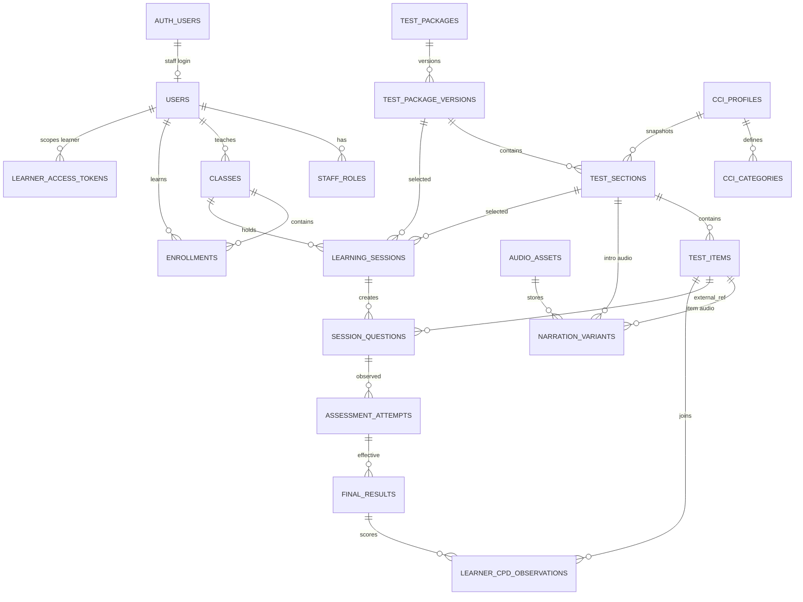

# Chunks-LMS V2 Domain and Architecture Contract

**Status:** Accepted architecture contract for Wayfinder ticket [Lock the V2 domain and OpenSpec architecture contract](https://github.com/genshai-11/Chunks-LMS/issues/4)  
**Date:** 2026-07-19 GMT+7  
**Scope:** Architecture/specification only. No database migration, Auth replacement, Edge Function, UI, remote migration, or production deployment is implemented here.

## 1. Product boundary and supersession

This contract supersedes the completed OpenSpec change `add-live-test-resources` for future V2 work without rewriting that completed change. The existing change encoded a fixed 8 sections by 10 items seed model; V2 keeps hosted history and replaces only the _target architecture_ with flexible immutable Live Test Packages.

Chunks-LMS remains a Focus and Awareness measurement platform, not a general content-authoring system. V2 adds controlled package/version management, signed learner access, and 9Router-backed generation modules only where they feed live-test measurement and narration.

## 2. Locked domain decisions

| Area               | Contract                                                                                                                                                                                         |
| ------------------ | ------------------------------------------------------------------------------------------------------------------------------------------------------------------------------------------------ |
| Staff Auth         | Admin and Teacher authenticate with native Supabase Auth. Clerk is replaced; legacy Clerk identifiers become migration references only.                                                          |
| Learner access     | Learners remain profile-only in this version. Learner entry uses revocable, expiring, signed tokens and does not create learner Supabase Auth accounts.                                          |
| Workspace          | The app has a singleton internal Chunks workspace. Admin sees all workspace data; Teacher scope is derived only through Teacher-owned Classes and active Enrollments.                            |
| Live Test packages | Packages have flexible section/item counts. Draft versions may change; published versions are immutable and historical sessions reference snapshots.                                             |
| CCI                | CCI is modeled through CCI Profiles and CCI Categories. Published sections carry measurement snapshots, and allowed overrides create new snapshots rather than rewriting published measurements. |
| CVR                | `target_cvr_ohm` is a section-level target imported from CSV `Unit (Ohm)`. `measured_cvr = TC × LC × TL` is item-level validation data.                                                          |
| CPD                | `item_cpd = target_cvr_ohm × CCI`. `learner_cpd_score = item_cpd × finalized effective color score`.                                                                                             |
| Narration          | Intro narration and item narration independently select language and voice. Audio assets are referenced from private Storage; row payloads do not contain binaries.                              |
| CSV migration      | `Chunks-resource - CVR_new.csv` is a one-time migration input and validation source, not runtime truth.                                                                                          |
| Generation         | 9Router stays behind server-side modules. UI callers use small domain interfaces; no API keys or provider details are exposed to browser code.                                                   |
| Production         | No production action is part of this ticket. Remote migrations, Edge Function deploys, Vercel deploys, and pushes to main/master remain prohibited without explicit approval.                    |

## 3. Target domain contract

### 3.1 Identity and access

- `auth.users` owns staff login identity for Admin and Teacher.
- Domain `users` remain the product people records. Staff rows link to `auth_user_id`; learner rows keep `auth_user_id = null` in this version.
- `staff_roles` stores database-owned role grants: `admin` or `teacher`, active/inactive, audit timestamps.
- Learner invitation/access records store only opaque token hashes, expiry, revocation, issued-by staff, and learner/class scope.
- A learner token can read only one learner's permitted progress, attendance, schedule, and finalized/corrected report data for its scoped Class/Enrollment window.
- Authorization never depends on user-editable Auth metadata. RLS uses `auth.uid()` for staff and token-verification server modules for learner access.

### 3.2 Live Test packages

- `test_packages` are Admin-managed package containers inside the singleton workspace.
- `test_package_versions` are mutable only while `draft`; publishing freezes version metadata and all section/item measurement snapshots.
- `test_sections` replace fixed Test Blocks in target vocabulary. Section order is package-version scoped and count is flexible.
- `test_items` are package-version scoped through sections. Item order is section scoped and count is flexible.
- `session_questions.external_ref` remains the only assessment link, now using a stable versioned shape such as `live-test-item:<test_item_id>:v<package_version_id>` or an equivalent immutable item-snapshot identifier chosen in implementation.
- Learning Sessions reference the selected package version and section snapshot. Existing fixed-block columns remain compatibility inputs until migration maps them.

### 3.3 Measurement and narration

- A CCI Profile defines allowed CCI Categories and default values/labels.
- A published Test Section stores `target_cvr_ohm` and a CCI snapshot selected from its CCI Profile.
- A Test Item stores TC, LC, TL, and `measured_cvr` for validation; `measured_cvr` does not replace section `target_cvr_ohm` in CPD.
- `item_cpd` is derived from the section snapshot: `target_cvr_ohm × CCI`.
- `learner_cpd_score` is derived only after result finalization/correction: `item_cpd × effective color score` where Red/Yellow/Green/Purple map to 0/1/2/3.
- Intro narration variants belong to Test Sections; item narration variants belong to Test Items. Each variant records language, voice, provider metadata, audio asset, approval status, and source text hash.

## 4. ERD / schema proposal



### 4.1 Proposed new/changed tables

| Table                              | Purpose                                                                   | Key compatibility rule                                                                                             |
| ---------------------------------- | ------------------------------------------------------------------------- | ------------------------------------------------------------------------------------------------------------------ |
| `users.auth_user_id`               | Links Admin/Teacher domain users to Supabase Auth.                        | Nullable for learners; legacy Clerk IDs retained in migration/reference columns until cutover verification passes. |
| `staff_roles`                      | Database-owned Admin/Teacher role grants.                                 | Backfilled from current role/profile data; inactive users preserve history.                                        |
| `learner_access_tokens`            | Hashes revocable expiring learner tokens and their scope.                 | No raw token is stored; learner Auth accounts are not created.                                                     |
| `test_packages`                    | Package container and Admin ownership metadata.                           | Backfilled from `live_test_resources`.                                                                             |
| `test_package_versions`            | Draft/published/archived version state.                                   | Existing fixed resource becomes one package version; published rows are immutable.                                 |
| `cci_profiles` / `cci_categories`  | Measurement catalog for CCI defaults and labels.                          | Seeded from approved CSV interpretation and future Admin-managed catalogs.                                         |
| `test_sections`                    | Flexible ordered package sections with `target_cvr_ohm` and CCI snapshot. | Existing `live_test_blocks` map one-to-one to sections during migration.                                           |
| `test_items`                       | Flexible ordered item prompts and item-level validation data.             | Existing `live_test_items` map one-to-one; `unit_ohm` becomes section target only through migration rules.         |
| `narration_variants`               | Independent intro/item language and voice generation records.             | Existing audio refs become approved variants where available.                                                      |
| `generation_jobs`                  | Auditable 9Router LLM/TTS job lifecycle.                                  | Jobs never publish content automatically; human approval required.                                                 |
| `learner_cpd_observations` or view | Reproducible learner CPD scoring read model.                              | Recomputable from final/corrected result + immutable measurement snapshots.                                        |

## 5. Migration compatibility matrix

| Existing hosted data                                            | V2 target                                           | Compatibility rule                                                                                                             | Validation evidence required before remote migration                                          |
| --------------------------------------------------------------- | --------------------------------------------------- | ------------------------------------------------------------------------------------------------------------------------------ | --------------------------------------------------------------------------------------------- |
| `organizations`                                                 | Singleton Chunks workspace                          | Preserve existing UUID; do not create multi-org UI.                                                                            | Row count and ID snapshot before/after.                                                       |
| `users` / profile rows                                          | `users` + `staff_roles` + nullable `auth_user_id`   | Preserve public profile UUIDs. Add Supabase Auth links for staff only.                                                         | Staff email uniqueness report, learner rows with null auth links, inactive statuses retained. |
| Clerk subject fields/config                                     | Legacy reference columns or migration audit         | Do not authorize from Clerk after cutover; keep values only for rollback/reconciliation.                                       | Mapping table from Clerk subject/email to Supabase Auth user.                                 |
| Learner invite/share links                                      | `learner_access_tokens`                             | Existing public learner access is replaced by signed expiring tokens; no learner Auth accounts.                                | Token issuance dry-run, expiry/revocation test, no raw token persisted.                       |
| `live_test_resources`                                           | `test_packages` + `test_package_versions`           | One existing resource becomes one package/version; original rows remain until migration verification and rollback window pass. | Resource/version row parity and immutable published snapshot hash.                            |
| `live_test_blocks` fixed 1..8                                   | `test_sections` flexible order                      | Map block number to section order; remove future fixed count constraint.                                                       | Every old block has exactly one section; order preserved.                                     |
| `live_test_items` fixed 1..10                                   | `test_items` flexible order                         | Map item number to item order; remove future fixed count constraint.                                                           | Every old item has exactly one target item; external refs can be resolved.                    |
| CSV `Unit (Ohm)`                                                | `test_sections.target_cvr_ohm`                      | For the one-time CSV import, Unit (Ohm) is section-level target. Item rows retain raw source metadata for audit if needed.     | Per-section target derivation report and anomalies list.                                      |
| Item `tc/lc/tl/cvr_value`                                       | item validation fields `tc/lc/tl/measured_cvr`      | Recalculate `measured_cvr = TC × LC × TL`; do not use measured value as CPD target.                                            | Mismatch report for stored vs recalculated measured CVR.                                      |
| Item `cci_value`                                                | Section CCI snapshot/category value                 | Assign via selected CCI Profile/Category snapshot; preserve raw values in migration audit.                                     | Snapshot coverage report by section/item.                                                     |
| `cpd_value` generated as `cvr_value × cci_value`                | `item_cpd = target_cvr_ohm × CCI`                   | Historical reports that used old CPD remain explainable; V2 reporting uses immutable V2 formula from migration cutover onward. | Before/after CPD comparison report and accepted variance notes.                               |
| `learning_sessions.session_format`, prompt language, block refs | package version + section refs                      | Existing lesson sessions remain `lesson` with null package refs; test sessions map to selected package version/section.        | All test sessions resolve to a migrated version/section; all lesson sessions stay null.       |
| `session_questions.external_ref`                                | immutable versioned item ref                        | Rewrite only through additive compatibility mapping or resolvable view; do not delete questions/attempts/events.               | 100 percent external_ref resolution report.                                                   |
| Assessment attempts/events/corrections                          | unchanged lifecycle tables                          | Never rewrite, reset, or delete history. Reporting joins to effective corrected final result.                                  | Attempt/event/final/correction row counts and checksums before/after.                         |
| Audio asset refs                                                | private Storage `audio_assets` + narration variants | Existing audio links become approved variants; missing audio remains pending.                                                  | Storage path existence report, no binary payloads in DB.                                      |

## 6. RLS access matrix

| Surface                  | anon                       | Supabase Auth Admin                                              | Supabase Auth Teacher                                                                    | Signed learner token                                               | service role/server module                |
| ------------------------ | -------------------------- | ---------------------------------------------------------------- | ---------------------------------------------------------------------------------------- | ------------------------------------------------------------------ | ----------------------------------------- |
| Domain users             | No direct rows.            | Read/manage all workspace users; preserve history on deactivate. | Read self and learners through assigned Classes/Enrollments only.                        | Read scoped learner display fields only through token module/view. | Provision/migrate with audit.             |
| Staff roles              | No.                        | Read/manage role grants.                                         | Read own active grant only if needed for routing.                                        | No.                                                                | Backfill and reconcile.                   |
| Classes/Enrollments      | No.                        | Full workspace read/manage.                                      | Read/manage assigned Classes as allowed; never cross-class.                              | Read scoped Class/Enrollment summary only.                         | Migration/repair only.                    |
| Learning Sessions        | No.                        | Read all; corrections/admin workflows where allowed.             | Create/read/update assigned Class sessions.                                              | Read scoped learner session attendance/progress only.              | Backfill/migration only.                  |
| Assessment lifecycle     | No direct table access.    | Read all; correction permissions as policy defines.              | Write observations only for assigned Class sessions; read assigned history.              | Read finalized/corrected effective scoped learner results only.    | Atomic RPCs and migration verification.   |
| Test packages/versions   | No draft access.           | Create/update drafts, publish, archive, read all.                | Read published versions only.                                                            | Read only metadata needed by scoped reports, never drafts.         | Import/publish generation after approval. |
| CCI profiles/categories  | No.                        | Manage catalogs and publish snapshots.                           | Read active/published snapshots used by assigned test sessions.                          | Read only immutable snapshot values used in own reports.           | Seed/migration.                           |
| Narration/audio          | No public Storage listing. | Manage draft/generated/approved variants.                        | Read approved variants for assigned sessions.                                            | Read signed URLs only for scoped approved assets.                  | Generate/store/sign URLs.                 |
| Generation jobs          | No.                        | Create/review/approve jobs.                                      | Request jobs only where product allows; read submitted job status for assigned packages. | No.                                                                | Runs 9Router adapters with secrets.       |
| Reports/CPD observations | No.                        | Read all workspace observations with sample sizes.               | Read assigned Classes/Learners only.                                                     | Read own scoped reports only.                                      | Build refreshable read models.            |

RLS implementation rules:

- Enable RLS on every table in exposed schemas.
- Use policy `TO` clauses and `(select auth.uid())` wrappers for performance.
- Add indexes on all columns used in ownership/policy predicates.
- Do not use `raw_user_meta_data` for authorization.
- Keep any necessary security-definer helpers in a private, non-exposed schema with explicit `auth.uid()` checks and revoked public execute by default.
- Views exposed to clients must be `security_invoker = true` on Postgres 15+ or remain in private schemas.

## 7. Deep-module interfaces

These are target seams. Callers should not know table shapes, provider APIs, token signing internals, or CPD formula internals.

```ts
type StaffSession = {
  authUserId: string;
  role: "admin" | "teacher";
};

type LearnerAccessGrant = {
  learnerId: string;
  classId?: string;
  expiresAt: string;
  revokedAt?: string | null;
};

interface StaffAccessGateway {
  resolveStaffSession(): Promise<StaffSession | null>;
  requireAdmin(): Promise<StaffSession>;
  requireTeacherForClass(classId: string): Promise<StaffSession>;
}

interface LearnerAccessGateway {
  issueLearnerAccess(input: {
    learnerId: string;
    classId?: string;
    ttlSeconds: number;
    issuedByUserId: string;
  }): Promise<{ urlToken: string; expiresAt: string }>;
  verifyLearnerAccess(urlToken: string): Promise<LearnerAccessGrant>;
  revokeLearnerAccess(tokenId: string, actorUserId: string): Promise<void>;
}

interface TestPackageCatalog {
  previewCsvImport(file: FileLike): Promise<CsvImportPreview>;
  saveDraftPackage(command: SaveDraftPackage): Promise<TestPackageDraft>;
  publishPackageVersion(
    command: PublishPackageVersion,
  ): Promise<PublishedPackageVersion>;
  selectSectionForSession(
    command: SelectLiveTestSection,
  ): Promise<SessionQuestionPlan>;
}

interface MeasurementCatalog {
  saveCciProfile(command: SaveCciProfile): Promise<CciProfile>;
  snapshotSectionMeasurements(
    command: SnapshotSectionMeasurements,
  ): Promise<SectionMeasurementSnapshot>;
  calculateItemCpd(query: {
    testItemId: string;
    atVersionId: string;
  }): Promise<ItemCpd>;
}

interface LiveTestGeneration {
  generateTestItem(command: GenerateTestItem): Promise<GenerationJobReceipt>;
  generateNarration(command: GenerateNarration): Promise<GenerationJobReceipt>;
  approveGeneratedAsset(
    command: ApproveGeneratedAsset,
  ): Promise<ApprovedGenerationAsset>;
}

interface CpdReporting {
  calculateLearnerCpd(query: {
    learnerId: string;
    reportWindow: ReportWindow;
    filters?: LiveTestReportFilters;
  }): Promise<LearnerCpdReport>;
}
```

### 7.1 Module depth rules

- UI calls `TestPackageCatalog` for package workflows; it never edits section/item tables directly.
- UI calls `MeasurementCatalog` for measurement snapshots; it never recomputes `target_cvr_ohm × CCI` independently.
- UI calls `LiveTestGeneration`; 9Router provider choice, retries, secrets, and TTS storage stay server-side.
- Reports call `CpdReporting`; they do not join raw lifecycle tables ad hoc or duplicate correction-effective result rules.
- Tests should target these seams and accepted RPC/read-model seams, not private implementation helpers.

## 8. OpenSpec implementation dependency path

The active OpenSpec change `lock-v2-domain-architecture-contract` is the V2 contract and implementation tracker. Downstream tickets should update its task checkboxes as they complete:

1. [Replace Clerk identity with Supabase Auth and signed learner access](https://github.com/genshai-11/Chunks-LMS/issues/5) — depends on this contract's identity/access spec and RLS matrix.
2. [Introduce flexible immutable test packages and measurement catalogs](https://github.com/genshai-11/Chunks-LMS/issues/6) — depends on the package/version/section/item schema proposal.
3. [Migrate existing hosted live-test records and one-time CSV data safely](https://github.com/genshai-11/Chunks-LMS/issues/7) — depends on the compatibility matrix and package schema.
4. [Add CVR generation and TTS deep modules](https://github.com/genshai-11/Chunks-LMS/issues/8) — depends on server-side generation seams and narration variant storage.
5. [Upgrade Admin package management and Teacher live-test runtime](https://github.com/genshai-11/Chunks-LMS/issues/9) — depends on packages, generation, and Auth scope.
6. [Add correction-aware learner CPD reporting](https://github.com/genshai-11/Chunks-LMS/issues/10) — depends on immutable measurement snapshots and result lifecycle joins.
7. [Harden RLS, validate preview, and prepare controlled release](https://github.com/genshai-11/Chunks-LMS/issues/11) — depends on all previous implementation tickets and remains non-production until explicitly approved.

## 9. Validation gates for future implementation

Before any remote production action, a later release-control ticket must produce evidence for:

- OpenSpec strict validation.
- Lint, typecheck, tests, and production build.
- Supabase local migration apply/list/advisor checks.
- Migration dry-run compatibility reports for hosted row counts, external refs, CPD comparison, token behavior, and restore path.
- Preview/canary deployment validation.
- Commit/tag, rollback instructions, and explicit Lucy approval for the exact production action.
